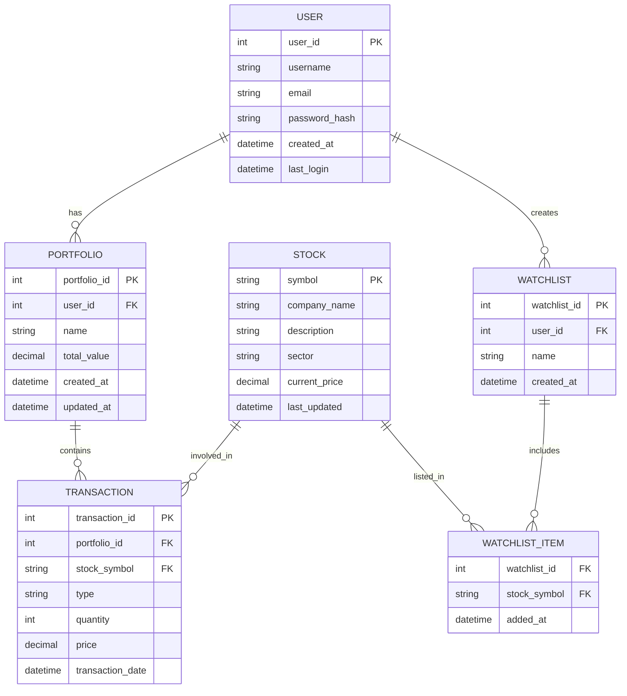

# Stock Trading Application

## Overview
A robust stock trading platform built with Spring Boot that enables users to manage and analyze stock market investments. The application provides real-time stock tracking, portfolio management, and secure trading capabilities.

## Features
- User Authentication & Authorization
- Real-time Stock Price Tracking
- Portfolio Management
- Transaction History
- Watchlist Creation and Management
- Stock Analytics and Reporting
- WebSocket Integration for Real-time Updates

## Technology Stack
- Backend: Spring Boot (Java)
- Database: MySQL/PostgreSQL
- Security: Spring Security with BCrypt password encoding
- Real-time Communication: WebSocket
- Build Tool: Maven
- Testing: JUnit, Spring Test

## Entity Relationship Diagram (ERD)


## API Endpoints

### Authentication
```
POST /users/register
- Register new user
- Body: { "username": string, "email": string, "password": string }

POST /users/login
- User login
- Body: { "username": string, "password": string }
```

### User Operations
```
GET /users/me
- Get current user profile

GET /users/me/positions
- Get user's current stock positions

GET /users/me/orders
- Get user's open orders

GET /users/me/trades
- Get user's trade history
```

### Stock Operations
```
GET /stocks
- Get all available stocks

PUT /stocks/{stockId}/price
- Update stock price
- Body: { "price": number }
```

### Portfolio Management
```
GET /portfolio
- Get user's portfolio summary

POST /portfolio/positions
- Create new position
- Body: { "stockId": number, "quantity": number }

PUT /portfolio/positions/{positionId}
- Update existing position
- Body: { "quantity": number }
```

## Project Structure
```
Stock_Trading/
├── src/
│   ├── main/
│   │   ├── java/
│   │   │   └── com/example/stocktrading/
│   │   │       ├── controller/
│   │   │       ├── model/
│   │   │       ├── repository/
│   │   │       ├── service/
│   │   │       └── dto/
│   │   └── resources/
│   └── test/
│       └── java/
├── .mvn/
├── node_modules/
└── websocket-client.js
```

## Installation

1. Clone the repository
```bash
git clone https://github.com/RewanshChoudhary/Stock_Trading.git
cd Stock_Trading
```

2. Configure Database
- Create a MySQL/PostgreSQL database
- Update `application.properties` with your database credentials

3. Install Dependencies
```bash
mvn install
```

4. Run the Application
```bash
mvn spring-boot:run
```

5. WebSocket Client (Optional)
```bash
npm install
node websocket-client.js
```

## Contributing
1. Fork the repository
2. Create your feature branch (`git checkout -b feature/amazing-feature`)
3. Commit your changes (`git commit -m 'Add some amazing feature'`)
4. Push to the branch (`git push origin feature/amazing-feature`)
5. Open a Pull Request

## License
This project is licensed under the MIT License

## Contact
Rewansh Choudhary
Project Link: https://github.com/RewanshChoudhary/Stock_Trading