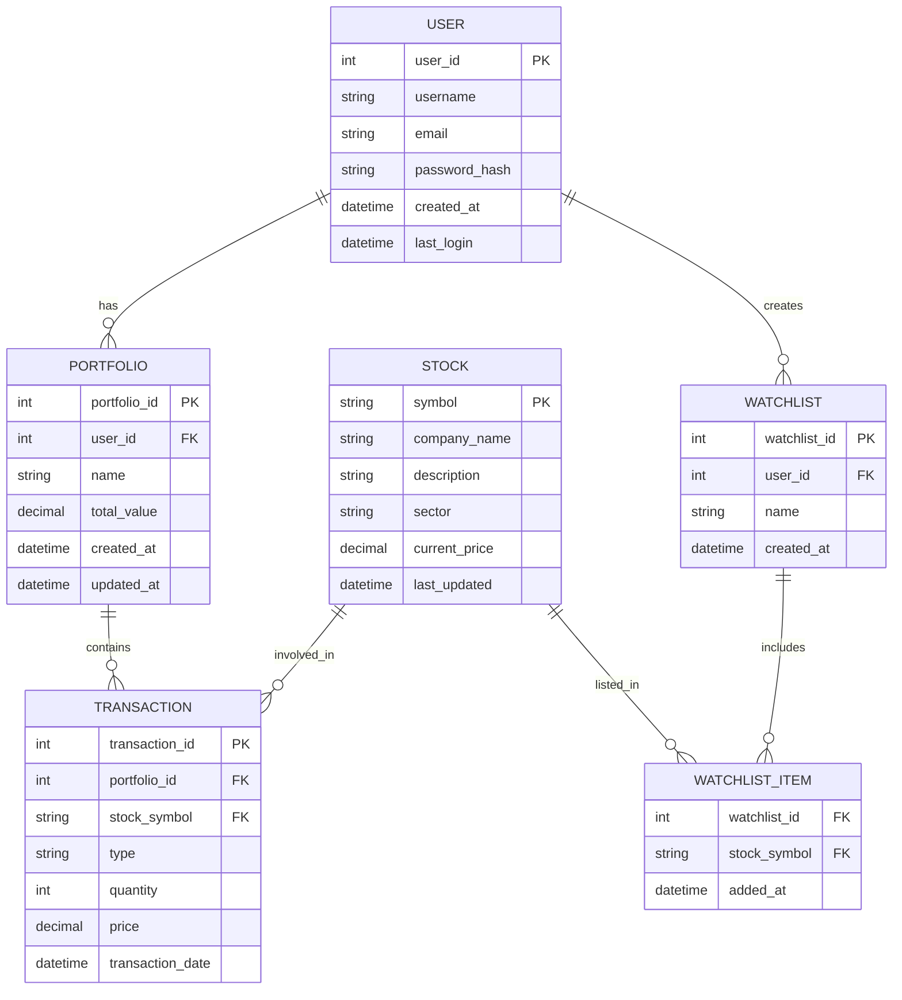

# Stock Trading Application

## Overview
This is a stock trading application that helps users manage and analyze stock market investments.

## Entity Relationship Diagram (ERD)


## Features
- User authentication and authorization
- Portfolio management
- Real-time stock tracking
- Transaction history
- Watchlist creation and management
- Stock analytics and reporting

## Technology Stack
- Backend: [Your backend technology]
- Frontend: [Your frontend technology]
- Database: [Your database system]
- Stock Data API: [Your chosen stock API]

## Installation

1. Clone the repository
```bash
git clone https://github.com/RewanshChoudhary/Stock_Trading.git
cd Stock_Trading
```

2. Install dependencies
```bash
# Add installation commands based on your tech stack
```

3. Configure environment variables
```bash
# Create .env file and add necessary configurations
```

4. Run the application
```bash
# Add commands to run your application
```

## Project Structure
```
Stock_Trading/
├── src/
│   ├── controllers/
│   ├── models/
│   ├── services/
│   └── utils/
├── tests/
├── config/
└── docs/
```

## API Documentation
- `/api/auth` - Authentication endpoints
- `/api/portfolio` - Portfolio management
- `/api/stocks` - Stock information and trading
- `/api/watchlist` - Watchlist operations

## Contributing
1. Fork the repository
2. Create your feature branch (`git checkout -b feature/amazing-feature`)
3. Commit your changes (`git commit -m 'Add some amazing feature'`)
4. Push to the branch (`git push origin feature/amazing-feature`)
5. Open a Pull Request

## License
This project is licensed under the MIT License - see the LICENSE file for details.

## Contact
Rewansh Choudhary - [@YourTwitter](https://twitter.com/YourTwitter)
Project Link: [https://github.com/RewanshChoudhary/Stock_Trading](https://github.com/RewanshChoudhary/Stock_Trading)